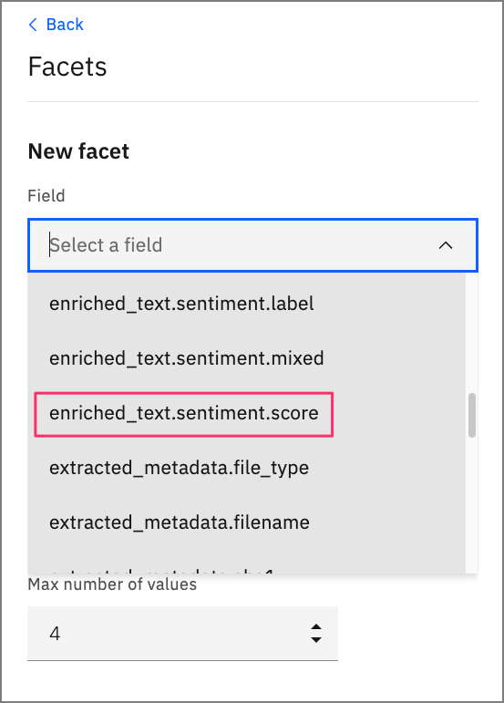
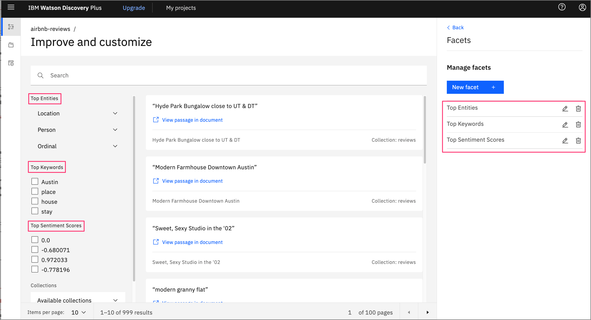
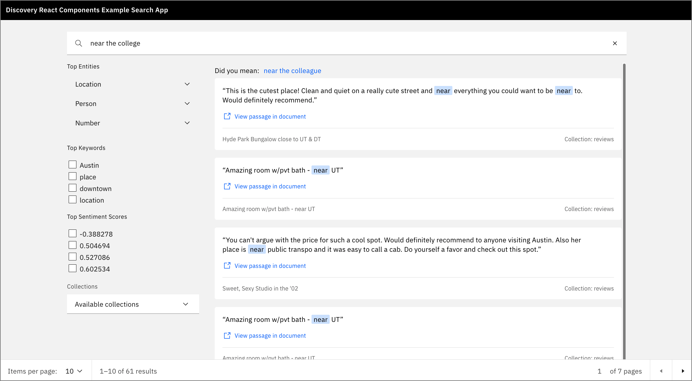

---
also_found_in:
- /learningpaths/get-started-watson-discovery
authors:
- email: Rich.Hagarty@ibm.com
  name: Rich Hagarty
check_date: '2022-10-11'
completed_date: '2021-10-12'
components:
- watson-discovery
draft: false
excerpt: データを充実させ、カスタム検索パネルを構築してデータを照会・視覚化し、Watson Discovery UI コンポーネントを使用してカスタムアプリケーションに検索パネルを複製します。
meta_description: データを充実させ、カスタム検索パネルを構築してデータを照会・視覚化し、Watson Discovery UI コンポーネントを使用してカスタムアプリケーションに検索パネルを複製します。
meta_keywords: Watson Discovery, query data, visualize data, search data
meta_title: Watson Discovery UIコンポーネントを使用したインテリジェントな検索アプリの作成
primary_tag: artificial-intelligence
related_content:
- slug: get-started-watson-discovery
  type: learningpaths
subtitle: Watson Discovery UIコンポーネントをアプリケーションに統合する
title: Watson Discovery UIコンポーネントを使用したインテリジェントな検索アプリの作成
---

IBM Watson Discovery は、データにコグニティブなエンリッチメントとインサイトを提供する強力なアナリティクス・エンジンを備えています。このチュートリアルでは、Discovery サービスの新機能である Watson Discovery UI コンポーネントを紹介します。これらのコンポーネントは Discovery プロジェクトに直接結びついており、検索アプリケーションに簡単にプラグインすることができます。コンポーネントは自己完結型であり、データを取得するために Discovery サービスへの追加の API 呼び出しは必要ありません。

## 学習目標

このチュートリアルでは、Watson Discovery サービスをナビゲートしてデータをロードし、管理する方法を学びます。これには、データに適用されるエンリッチメントの強化や、データを照会して視覚化するためのカスタムパネルの構築が含まれます。次に、[React](https://reactjs.org/)、[Express](https://expressjs.com/)、および Watson Discovery UI コンポーネントを使用して構築された独自のアプリケーションで検索パネルを複製する方法を学びます。

## 前提条件

このチュートリアルを進めるには、Watson Discovery のインスタンスをプロビジョニングできる [IBM Cloud アカウント](https://cloud.ibm.com/login?cm_sp=ibmdev-_-developer-tutorials-_-cloudreg)を持っている必要があります。

## 見積もり時間

このチュートリアルを完了するには、約 60 分かかります。

## ステップ

1.[Watson Discoveryを起動する](#launch-watson-discovery)
1.[新しいプロジェクトを作成する](#create a-new-project)
1.[データファイルをコレクションにアップロードする](#upload-data-files-into-collection)
1.[データを充実させる](#データを充実させる)
1.[検索パネルにエンリッチメントを追加する](#add-enrichments-to-search-panel)
1.[UIアプリの作成](#create-your-ui-app)
1.[キーファイルとコンセプト](#key-files-and-concepts)

### Watson Discovery を起動する

IBM Cloud のアカウントをお持ちでない方は、[無料トライアルアカウント](https://cloud.ibm.com/registration?cm_sp=ibmdev-_-developer-tutorials-_-cloudreg)にご登録ください。

1.IBM クラウドアカウントを使用して、[リソースカタログ](https://cloud.ibm.com/catalog/services/discovery?cm_sp=ibmdev-_-developer-tutorials-_-cloudreg)から Watson Discovery インスタンスを作成し、**Plus**プランを選択します。

    **Note:** IBM Watson Discovery の Plus プランの最初のインスタンスには、30 日間の無料トライアルが付いています。この演習を経て、Watson Discovery の Plus インスタンスが必要なくなった場合は、削除することができます。

    

1.Discovery インスタンスのページから、**Launch Watson Discovery** をクリックします。

### Create a new project

1.Discovery サービスのランディングページに、現在のプロジェクトの一覧が表示されます。新規プロジェクト**」をクリックします。

    

1.このチュートリアルでは、*Document Retrival*タイプのプロジェクトを作成します。プロジェクトの種類を選択し、プロジェクトに固有の名前を付けて、「次へ」をクリックしてください。

    

### データファイルをコレクションにアップロードする

1.次のステップでは、データをどこから持ってくるかをDiscoveryに伝えます。この例では、JSON データファイルからデータをアップロードするので、**データのアップロード**をクリックして、**次へ**をクリックします。

    

1.コレクション名**を入力して、**Next**をクリックします。
    
    

    **注意：**プロジェクトには複数のコレクションを含めることができます。ディスカバリーでは、プロジェクトレベルで検索を行い、デフォルトではそのプロジェクト内のすべてのコレクションを含みます。

1.1. アップロードパネルで、**ファイルをここにドラッグ＆ドロップするか、アップロードする**というテキストをクリックします。これにより、ファイルウィンドウが開き、アップロードするファイルを選択できます。
    
    このチュートリアルでは、テキサス州オースティンのAirBnBのお客様から投稿された999件のレビューを使用します。各レビューには、タイトル、AirBnBのロケーションとホスト名、レビュアーの名前、評価スコア、レビューのテキストがあります。

1.AirBnB reviews file](static/AirBnb.zip)をお使いのシステムにダウンロードして解凍し、アップロードする999個のJSONファイルを選択します。

    

1.操作が完了したら、**Finish**をクリックします。

データのアップロードが開始されます。アップロードが完了すると、ディスカバリーではアラートが表示されます。

### Enrich the data

1.左側の **コレクションの管理** をクリックして、プロジェクトに関連するすべてのコレクションを表示します。

    **注：**現在作業しているプロジェクトを変更するには、ページ上部の「マイプロジェクト」をクリックします。

    

    先ほど作成したコレクションをクリックすると、999件のレビューがすべて読み込まれているのがわかります。

    

1.Enrichments**」をクリックします。ご覧のとおり、デフォルトのエンリッチメントは、*Part of speech*と*Entities v2*です。このレビューデータでは、*Keywords*と*Sentiment of Document*も含めることにします。

    

1.これらの新しいエンリッチメントのそれぞれについて、「**Fields to enrich**」をクリックし、「**text**」フィールドを選択します。

### 検索パネルへのエンリッチメントの追加

新しいエンリッチメントができたので、デフォルトの検索パネルに追加します。

1.左側の**Improve and customize**をクリックして、コレクションに関連した検索パネルを表示します。

    

1.ディスプレイをカスタマイズするには、すべてのファセットを追加します。まず、パネルの右側にある**Customize display**のドロップダウンメニューをクリックします。

1.1. **Facets**, **New facet**, **From existing fields in collection**の順にクリックします。

1.Keyword**ファセットでは、**enriched_text.keywords.mentions.text**というフィールドを選択します。これは、データに含まれる最も一般的なキーワードを提供します。

    

1.UIコンポーネントに意味のあるラベルを入力して、**Apply**をクリックします。

    

1.Sentiment**ファセットのプロセスを繰り返しますが、フィールド**enriched_text.sentiment.score**を使用します。

    

1.完成すると、ファセットが検索パネルの一部になったことがわかります。

    

検索文字列を入力すると、検索結果が表示されるとともに、検索にマッチしたレビューのサブセットを反映した新しいファセット値が表示されます。


いずれかのレビューで**View passage in document**をクリックすると、レビューデータにドリルダウンします。JSON**タブをクリックすると、Discoveryから返された実際の結果を見ることができます。


このケースでは、検索がレビューの `title` にマッチするものを見つけたことに注目してください。実際のレビューは `text` フィールドに表示されています。

### UIアプリの作成

検索パネルがデータの興味深い側面をすべて表示するように強化されたので、同じパネルを表示するアプリケーションを作成します。この作業には、Watson Discovery が提供する [スターターキット](https://github.com/watson-developer-cloud/discovery-components) を使用します。

スターターキットには、アプリを開発するための複数の方法が用意されていますが、このチュートリアルでは、手動の方法を選択して、Discovery コレクションを同社のサンプルアプリに統合します。

#### Clone the repo

1.まず最初に、GitHub のリポジトリをローカルシステムにクローンします。

``bash
$ git clone https://github.com/watson-developer-cloud/discovery-components.git
$ cd journeys/discovery-components
```

#### 認証情報の収集

1.IBM Cloud と Watson Discovery の起動パネルに戻り、API キーとサービス URL を取得します。

    

1.また、プロジェクト ID も必要で、これはプロジェクトの Watson Discovery Integrate and deploy パネルから取得できます。

    

#### 環境ファイルへの認証情報の追加

1.ローカル・レポのルート・ディレクトリで、以下のコマンドを実行して環境ファイルを作成します。なお、環境ファイルはexamples/discovery-search-appディレクトリに作成する必要があります。

    ``bash
    $ cd examples/discovery-search-app
    $ cp .env .env.local
    $ echo "DISCOVERY_AUTH_TYPE=iam
    DISCOVERY_URL=<ディスカバリーURL>に置き換えてください。
    DISCOVERY_APIKEY=<APIキーを置き換えてください>"> ibm-credentials.env
    ```

1.ibm-credentials.envファイルをDiscoveryの認証情報で更新し、.env.localファイルをプロジェクトIDで更新します。

#### アプリのビルドと実行

これで、プロジェクトのルートディレクトリに戻り、アプリをビルドして起動することができます。

以下のコマンドを実行するには、ローカルシステムに[Yarn](https://yarnpkg.com/)パッケージマネージャがインストールされている必要があります。

``bash
$ cd .../...
$ yarn ワークスペース @ibm-watson/discovery-react-components run build
$ yarn ワークスペース discovery-search-app run start
```

起動すると、ベースとなる検索パネルが表示されたブラウザが開きます。検索文字列を入力すると、一致するレビューのリストが表示されます。



発見ツールで追加したすべてのファセットがここに表示されることに注目してください。

## 主なファイルとコンセプト

Discovery UI アプリは、React クライアントと Express サーバーで構成されています。コードを調べるには、examples/discovery-search-appサブディレクトリに移動します。そこでは、Reactのコードはsrcディレクトリに、Expressのコードはserver.jsファイルにあります。

以下のコードでは、Discovery UIのReactコンポーネントがインポートされています。

``js
// examples/disovery-search-app/src/App.js

インポート {
  DiscoverySearch,
  SearchContext,
  SearchApi,
  SearchInput,
  SearchResults,
  SearchFacets,
  ResultsPagination,
  DocumentPreview,
  CIDocument,
  canRenderCIDocument
} from '@ibm-watson/discovery-react-components';

...

    <DiscoverySearch searchClient={searchClient} projectId={projectId}> です。
      <AppView />（アップビュー
    </DiscoverySearch> </DiscoverySearch

```

先ほどのリストの中で、主要なコンポーネントは `DiscoverySearch` です。このコンポーネントでは、DiscoveryクライアントとプロジェクトIDをパラメータとして渡す必要があります。このように、各コンポーネントの詳細はすべて自己完結しているため、使用するための追加のプログラミングは必要ありません。

**注：**これらの UI コンポーネントが開発される前は、独自の UI コンポーネントを作成し、Watson Discovery API を使用して Discovery データに結び付ける必要がありました。提供されているコンポーネントは、典型的な Discovery 検索アプリケーションで見られる最も一般的な UI コンポーネントを扱うための良い出発点となりますが、高度なカスタムコンポーネント (例えば、センチメントスコアの時系列推移を示す折れ線グラフチャートなど) については、従来のアプローチを使用する必要があります。

クライアントがDiscoveryサービスのインスタンスにアクセスするには、サーバからインスタンスを取得するか、クライアント側でDiscoveryサービスをインスタンス化する必要があります。このアプリの例では、プロキシを使用してこれを行います。プロキシは、クライアントが Discovery インスタンスをインスタンス化するための呼び出しを行うことで開始されます。

``js
// examples/disovery-search-app/src/App.js

const authenticator = new NoAuthAuthenticator();
const searchClient = new DiscoveryV2({
  url:`${window.location.href}api`,
  version: '2019-01-01',
  認証子
});
```

しかし、この場合のURLは、サーバーへのルートです（`api`がルートに付加されていることに注意してください）。サーバーコードは、このルートを処理するためにプロキシを使用します。

``js
// examples/disovery-search-app/server.js

const express = require('express');
const app = express();
const proxy = require('./src/setupProxy.js');

...
proxy(app);
```

このルートでプロキシが呼び出されると、プロキシは資格情報ファイルを使って Discovery サービスから認証トークンを取得して返すという作業を行います。

```js
// examples/disovery-search-app/src/setupProxy.js

const addAuthorization = async (req, _res, next) => { 。
  const authenticator = getAuthenticatorFromEnvironment('discovery');
  Try {
    const accessToken = await authenticator.tokenManager.getToken();
    req.headers.authorization = `Bearer ${accessToken}`;
  } キャッチ（e） {
    console.error(e);
  }
  return next();
};

...

app.use(
  '/api',
  addAuthorization,
  プロキシ({
    ...
  })
);
```

クライアントサイドの視点から見ると、 Discoveryサービスのインスタンスをインスタンス化するための呼び出しは、 認証子が実際のトークンで置き換えられているため、 うまく機能しています。また、クライアントは、認証情報をクライアントコードに埋め込んだり、ブラウザのコンソールに表示したりすることを気にする必要がありません。

## まとめ

このチュートリアルでは、Watson Discovery ツールを操作してプロジェクトを作成し、データをコレクションにアップロードする方法を学びました。その後、データを強化し、データを照会して視覚化するためのカスタム検索パネルを構築する方法を学びました。


最後に、Watson Discovery UI コンポーネントを使用して、同じ検索パネルをカスタム アプリケーションで再現しました。

